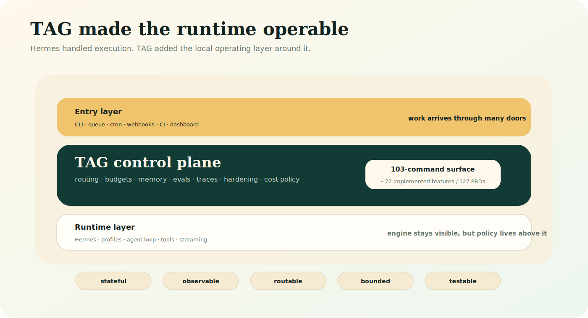
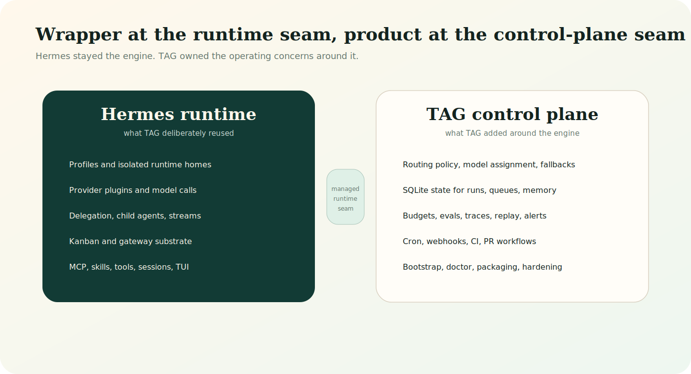
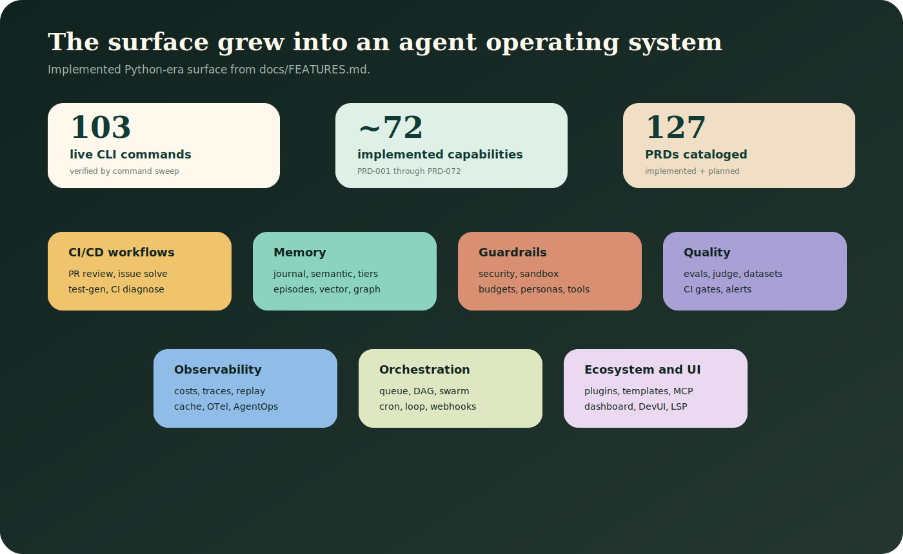
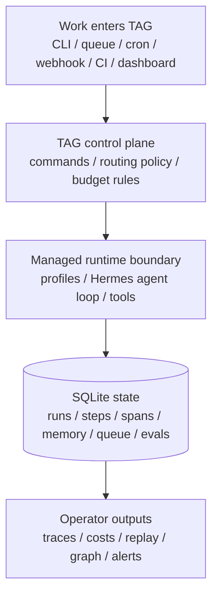
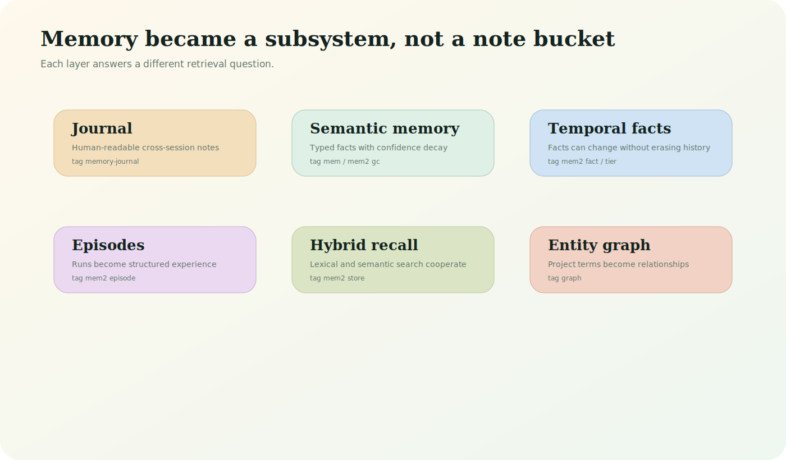
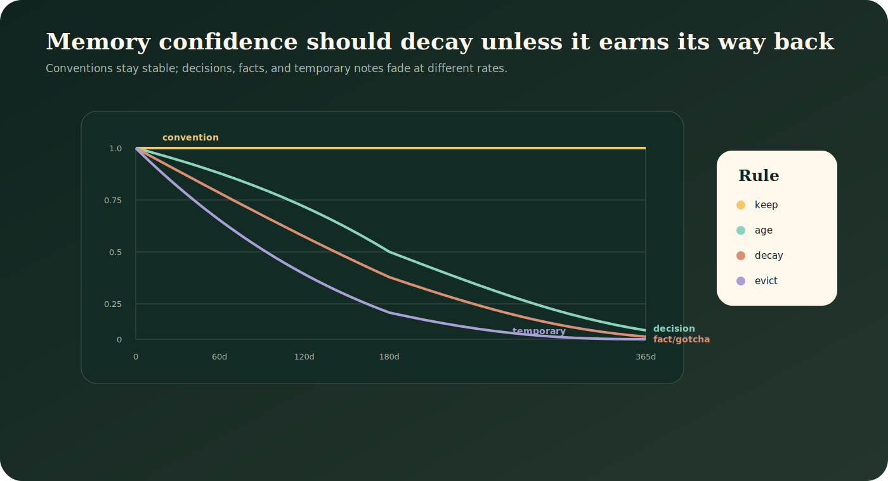
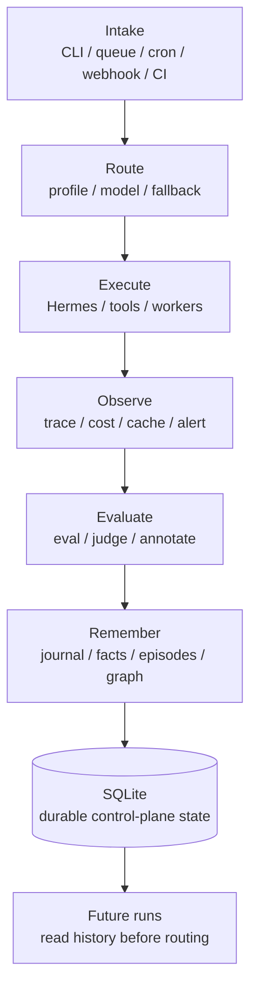
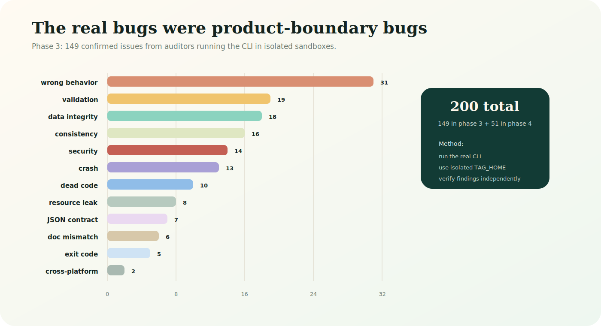
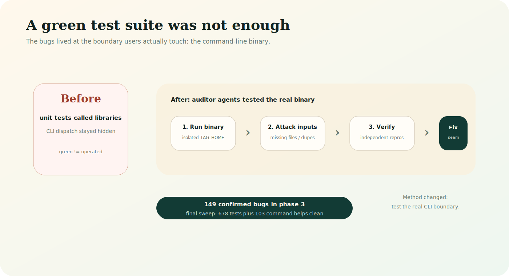
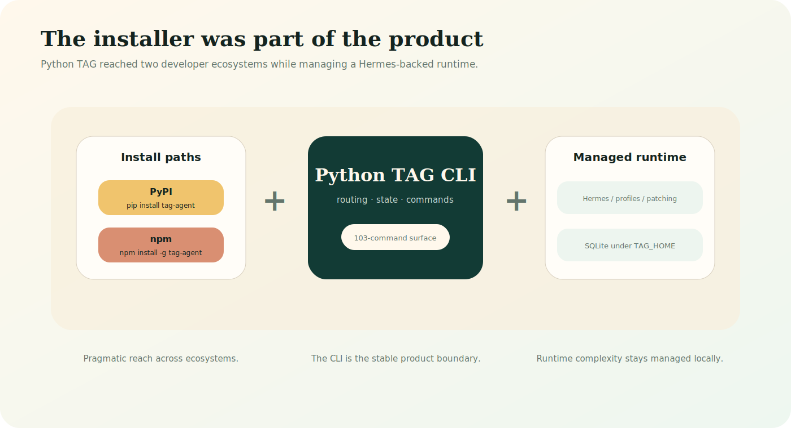

# TAG: building the missing operating layer for agent runtimes

*The story of the Python version: how a Hermes-backed wrapper became a 103-command local control plane with routing, memory, queues, budgets, evals, traces, webhooks, and a hardening corpus.*

Most agent projects begin with the runtime.

That makes sense. The runtime is the visible magic: a model call, a tool loop, a terminal stream, a plan, a patch, a reply. Hermes already had a lot of that. It had profiles, providers, delegation, Kanban, an API server, Codex-aware runtime paths, and the basic shape of a serious local agent environment.

TAG started from a different question:

> If Hermes is the engine, what is the operating layer around it?

Not another prompt wrapper. Not a thin alias. Not a rebrand of every upstream command. A local control plane that could answer the operational questions that show up the moment an agent stops being a demo:

- Which profile should handle this task?
- Which model should do the cheap work, and which model should verify?
- Where did this run spend tokens?
- What did the agent do last week?
- Which memories are still trustworthy?
- Can a webhook, cron job, queue item, PR review, eval run, and manual submit all enter one system?
- Can the whole thing be installed by a Python user and a JavaScript user without asking either one to understand the runtime internals?
- When the test suite is green but the CLI is broken, how do we find the bugs that users will hit?

That is the Python TAG story.

It is important to say what this article is and is not about. This is about the Python implementation as it exists in the Hermes-backed era: a wrapper in the literal runtime sense, but a control plane in the product sense.

The difference matters.



## The thing Hermes was good at, and the thing it was not trying to be

Hermes was already a strong substrate. The local audit describes Hermes as covering:

- separate profiles with config, environment, memory, sessions, cron, skills, and aliases;
- provider runtime support across OpenRouter, OpenAI/Codex, DeepSeek, custom endpoints, and multiple API modes;
- isolated delegation with concurrency and model/provider overrides;
- durable Kanban boards with cross-profile routing;
- an API server with OpenAI-compatible endpoints;
- Codex-aware execution paths and plugin/MCP integration.

That is not a toy runtime. It is a capable engine.

But an engine is not a fleet manager.

The local gap analysis named the missing layer clearly. Hermes was profile-centric, but not a full run scheduler. It could override delegation models, but did not ship a complete policy engine for "research goes here, implementation goes there, verification escalates here." It had durable workflow primitives, but not a central benchmark/eval loop that learns which route works for which task. It had runtime sessions, but not the same cross-run cost policy, budget enforcement, trace export, PR review loop, alerting, or project-wide memory strategy that TAG wanted.

That is where TAG fits.



The first useful mental model was a three-bucket contract:

- **TAG-native:** setup, doctor, routing, assignments, model policy, submit, benchmarks, run history, imports, queues, memory, costs, traces, evals, webhooks, dashboards, and hardening.
- **First-class Hermes wrappers:** chat, gateway, kanban, model, profile, status, config, sessions, skills, plugins, tools, MCP, logs, dashboard, memory, completion, prompt-size, update, and TUI.
- **Managed passthrough:** the long tail stays reachable through `tag hermes -- ...` instead of being copied and renamed prematurely.

That last part is important. The project did not need to pretend Hermes did not exist. The project needed to make Hermes operable.

## Why "just a wrapper" is the wrong frame

There is a cheap criticism that every runtime-backed CLI gets: "Isn't this just a wrapper?"

Sometimes, yes. If all you do is forward arguments, the wrapper label is accurate.

TAG forwards some commands. But the value of the Python version was not argument forwarding. The value was the local operating system around the runtime:

- a managed install and profile bootstrapper;
- a multi-profile routing layer;
- a SQLite state store in WAL mode;
- a command surface for queues, DAGs, cron, loops, swarm, and Kanban;
- semantic, temporal, episodic, vector, and graph memory;
- cost attribution, token budgets, traces, replay, cache analytics, and OTel export;
- eval suites, LLM-as-judge, versioned datasets, eval CI, alert rules, annotations, and prompt versioning;
- security scanning, sandbox execution, PR review, issue solving, CI diagnosis, flaky-test remediation, and SWE harnesses;
- plugin/template/marketplace/MCP surfaces;
- dashboard, DevUI, desktop, TUI, and LSP entrypoints;
- a distribution layer through PyPI and npm.

The runtime still reasons. TAG decides how the runtime is prepared, routed, bounded, observed, remembered, tested, and shipped.

That is the control-plane boundary.

## The surface area that emerged

The project now tracks roughly 127 PRDs. The first 72-ish are implemented across a live 103-command CLI surface; the remaining 55-ish are planned or proposed. The exact count is less important than the shape of the feature map.

The implemented work is not one category. It is a stack of operating concerns.



The broad clusters are:

- **Foundation:** setup, bootstrap, doctor, render, managed runtime provisioning, branding bridge, profile isolation, and local state.
- **Credential and execution imports:** Codex, Claude, Gemini, Continue, Mistral, OpenCode, Zed, Copilot, Aider, AWS, Cursor, Supermemory, Honcho, Nous Portal, Docker, SSH, Modal, and Daytona.
- **Routing and models:** task routing, assignments, model switching, submit, OpenRouter model discovery, benchmark, compare, and fallback chains.
- **Memory and knowledge:** memory journal, semantic memory, confidence decay, extraction, garbage collection, tiers, temporal facts, episodic sessions, hybrid search, vector store, and entity graph.
- **Queue and orchestration:** queue, dependency DAG, queue-dep, swarm, Kanban, loop, cron, and background workers.
- **Observability and cost:** costs, pricing, traces, replay, diff, checkpoint, snapshot, cache analytics, OTel export, AgentOps bridge, and per-span attribution.
- **Evaluation and quality:** eval, eval-judge, eval-dataset, eval-CI, alert rules, annotation queue, and prompt hub.
- **Agentic dev workflows:** PR review, CI diagnosis, test generation, GitHub/GitLab pipeline generation, SAST remediation, flaky-test repair, SWE harness, issue-to-PR loop, and webhooks.
- **Security and guardrails:** secret scanning, budgets, sandbox execution, notification hooks, diff context, personas, tool indexing, and context management.
- **Ecosystem and UI:** plugins, templates, marketplace, MCP registry, natural language shell, dashboard, DevUI, desktop launcher, TUI, and LSP.

Writing the feature list point by point would be unreadable. The better story is how those features form an operating layer.

## The architecture: local-first, stateful, and deliberately boring

TAG's Python architecture is not exotic. That is one of its strengths.

The core loop is:

1. A task enters through a CLI command, queue, cron job, webhook, eval, PR workflow, or dashboard/API action.
2. TAG loads configuration and profile policy.
3. A route is selected based on task type, profile, model assignment, fallback rules, and execution mode.
4. The runtime is invoked through Hermes-backed execution paths or TAG-native worker logic.
5. The run emits state: steps, spans, costs, cache data, queue status, memory candidates, eval results, alerts, and trace records.
6. SQLite stores the durable record.
7. Later commands inspect, replay, summarize, budget, alert on, or learn from that state.



The boring pieces matter:

- **SQLite:** local, inspectable, durable, WAL-backed, easy to migrate, and enough for a single-developer control plane.
- **Profiles:** each role has its own config, model, credentials, and runtime home.
- **Commands:** the CLI is the product boundary, not just a developer convenience.
- **State:** runs and decisions are not terminal scrollback; they are rows that can be queried, exported, and tested.
- **Runtime boundary:** Hermes can remain the engine while TAG owns policy and operations.

This makes TAG feel less like "one agent command" and more like a small local platform.

## Routing: the first real control-plane feature

The first sharp product idea was route policy.

A single all-purpose model is convenient, but it is a bad default for cost, latency, and verification. TAG's model is closer to an operating policy:

- an orchestrator can plan;
- a researcher can gather;
- a coder can implement;
- a reviewer can verify;
- a task type can choose the lane;
- a stronger or more expensive model can be saved for verification rather than every token.

This is where Hermes was a good substrate. Hermes already had profiles and delegation. TAG added a policy surface over them: role defaults, model assignments, route inspection, task-type routing, benchmark history, fallback chains, and submit behavior that can choose between direct execution and durable Kanban flow.

The point was not to cosplay as a team of agents. The point was to make routing inspectable and changeable.

The pattern that emerged was simple:

- **Research:** researcher does the work, reviewer checks it.
- **Implementation:** coder does the work, reviewer checks it.
- **Review:** reviewer acts directly.
- **Mixed:** multiple specialists contribute before verification.

This became one of TAG's core differentiators over a raw runtime. The runtime can run a profile. TAG can decide which profile should run and why.

## Memory: not one feature, a subsystem

The previous article was too small here. Memory in TAG is not just "save facts and search them."

The implemented memory work spans multiple ideas:

- **Cross-session journal:** human-readable facts and notes that survive a run.
- **Semantic memory:** typed memories with confidence and full-text search.
- **Confidence decay:** older memories become less dominant unless they are durable or recalled.
- **Garbage collection:** low-value or duplicated memories can be consolidated.
- **Hierarchical tiers:** core, recall, and archival memory separate what must stay hot from what can fade.
- **Temporal facts:** facts can change over time instead of overwriting history.
- **Episodic sessions:** complete run episodes can be stored as structured experience.
- **Hybrid/vector search:** lexical and semantic retrieval can work together.
- **Entity graph:** extracted entities and co-occurrences create a project knowledge map.



This matters because agent memory has a failure mode: it either remembers nothing, or it remembers everything with too much confidence.

TAG's design is more nuanced. A project convention should remain stable. A decision should age slowly. A gotcha should be useful for a while but not dominate forever. A temporary debugging note should fade. A session episode should preserve the story of what happened, not just the final fact.

The memory-decay visual is still useful because it captures the core ranking idea.



The more interesting part is that decay is only one layer. The memory system became a small knowledge system:

- FTS5 gives local lexical search.
- Confidence gives time-aware ranking.
- Tiers give retention policy.
- Temporal facts preserve history.
- Episodes preserve workflow memory.
- Vector search helps recall fuzzy concepts.
- The entity graph turns repeated co-occurrence into structure.

That is a serious difference from dumping notes into context.

## Queues, DAGs, cron, loops, and swarm: agents need work management

An agent that only runs while you stare at it is a toy compared with an agent that can be scheduled, queued, retried, inspected, and bounded.

TAG's orchestration layer grew because the entrypoints multiplied:

- direct submit for one-off work;
- queue for background tasks;
- dependency-aware DAGs for ordered work;
- cron for scheduled jobs;
- loops for iterative autonomous work;
- swarm for parallel decomposition;
- Kanban for durable multi-profile handoff;
- webhooks for external event triggers;
- CI and PR commands for repository workflows.

The important idea is not "many ways to start work." The important idea is that these entrypoints converge into a shared operating model.



That convergence is what makes the CLI feel like a control plane:

- queue jobs can produce notifications;
- webhooks can enqueue agent work;
- cron can run the same command surface;
- eval failures can become CI signals;
- traces and costs can be inspected after the fact;
- memory can learn from completed runs;
- budgets can stop runaway behavior.

Without this layer, each workflow becomes a separate script. With it, they become different doors into the same system.

## Observability: if it happened, it should be inspectable

Agent work is expensive and nondeterministic. That makes observability more important, not less.

TAG records:

- runs and steps;
- spans and trace events;
- costs and token usage;
- cache behavior;
- benchmark outputs;
- queue status;
- eval results;
- alert firings;
- snapshots and replay checkpoints;
- OTel GenAI-compatible exports.

The point is not only dashboards. The point is forensics.

If a command generated a bad patch, you should be able to ask:

- which profile ran it?
- which model?
- what did it cost?
- what route did it take?
- which tool calls happened?
- which cache hits happened?
- did the verifier run?
- did an eval fail?
- did an alert fire?
- can I replay or diff the trace?

This is another place where "runtime versus control plane" becomes concrete. The runtime streams a session. The control plane builds an audit trail.

## Evals and quality: "looks good" is not a release process

The eval surface is one of the places where the project starts to look less like a wrapper and more like an agent engineering platform.

TAG includes:

- eval suites;
- LLM-as-judge evaluators;
- versioned eval datasets;
- eval CI gates and PR comments;
- metric-based alert rules;
- human annotation and labeling queues;
- prompt versioning.

That combination matters because every agent project eventually hits the same question: how do we know it got better?

Manual vibes do not scale. Neither do screenshots of a good run. TAG's quality stack gives the project a way to treat agent behavior as something that can be versioned, evaluated, annotated, and gated.

It is not enough to have a clever route. The route needs feedback. It is not enough to have memory. Memory needs tests that catch when it retrieves the wrong thing. It is not enough to have a prompt. Prompts need version history and regression checks.

That is the operating-layer thesis again.

## Security and guardrails: the boring parts become product features

The more an agent can do, the more the guardrails matter.

TAG's Python implementation includes token budgets, alerts, secret scanning, sandbox execution, webhook HMAC handling, SSRF hardening, path validation, notification hygiene, diff-aware context, and CI/security repair workflows.

Some of those features were planned. Some were forced by adversarial testing.

The bug-bash reports are blunt. They found issues in webhook signature enforcement, notification injection, world-readable secret files, SSRF, sandbox escapes, path traversal, cron semantics, data integrity, JSON contracts, dead code, exit codes, resource leaks, and concurrency races.

That is exactly the sort of bug surface a real control plane has.

The lesson was not "Python bad." The stack decision docs made the opposite point: only a small fraction of the bug corpus was language-attributable dynamic dispatch. Most bugs were semantic, contract, validation, concurrency, or security bugs that a rewrite would reintroduce unless the product boundary was tested the same way.

## The hardening work was the product turning point

The most valuable project phase was not adding another command. It was running the command surface adversarially.

The phase-3 bug bash used 14 domain auditors. They read modules, ran commands in isolated sandboxes, verified findings, deduped results, and produced 149 confirmed bugs:

- 4 critical;
- 30 high;
- 42 medium;
- 73 low.

The taxonomy is more important than the count:

- wrong behavior;
- validation bugs;
- data integrity bugs;
- security bugs;
- crashes;
- JSON contract bugs;
- resource leaks;
- exit-code mistakes;
- consistency issues;
- doc mismatches;
- cross-platform bugs;
- dead code.



Then the phase-4 pass found 51 more confirmed bugs while verifying the fixes and stressing the changed code. It ended with 678 tests passing and a 103-command `--help` sweep clean.

That is the kind of number that means something because of the method:

1. Run the binary, not just library functions.
2. Use isolated `TAG_HOME` sandboxes.
3. Test the CLI contracts users touch.
4. Attack missing files, duplicate names, weird flags, malformed JSON, bad config, concurrency, and security boundaries.
5. Verify each finding independently.
6. Fix the boundary and add regression coverage.



This changed the project. Before that work, TAG had features. After that work, TAG had evidence that the feature surface could survive contact with users.

## Distribution: the product includes the installer

For a developer tool, installation is part of the product.

TAG shipped the Python implementation through PyPI:

```bash
pip install tag-agent
```

And through npm:

```bash
npm install -g tag-agent
```

The npm package is a Node launcher that provisions an isolated Python runtime under `~/.tag/npm-runtime/<version>/` on first use. The Python package provides the actual CLI and managed runtime logic.

This is not the cleanest possible distribution story. It exists because the Python TAG implementation sits around a Python/Hermes runtime while also needing to be discoverable to JavaScript-heavy developers.



The article should be honest about the tradeoff:

- PyPI is natural for the Python implementation.
- npm improves discoverability for JS/devtool users.
- the managed Hermes runtime creates real artifact and first-run complexity.
- one-line install still matters because nobody evaluates a control plane they cannot start.

This was a pragmatic bridge, not a perfect end state.

## The PRD catalog became a product map

The PRD set is not just planning paperwork. It shows how the project expanded from a thin runtime wrapper into a platform-shaped control plane.

The first 72 implemented PRDs cover the Python-era product core:

- memory and context;
- rich TUI and diagnostics;
- queueing and scheduling;
- routing and model management;
- cost and budget enforcement;
- tracing and replay;
- evals and CI gates;
- security scanning and sandboxing;
- webhooks and notifications;
- plugin, marketplace, template, and MCP surfaces;
- dashboard, DevUI, LSP, and desktop entrypoints;
- agentic workflows from PR review to issue solving.

The later planned PRDs show the frontier:

- MCP ecosystem and auth;
- agent-to-agent interoperability;
- richer sandbox environments;
- advanced reasoning/planning;
- workflow state and graph execution;
- browser/computer use;
- guardrail processors;
- inference-time tree search and profile evolution.

That map is why the Python version deserves a larger article. The interesting story is not "I wrapped Hermes." It is "I used Hermes as a runtime substrate and built the surrounding operating system until the product surface exposed what an agent control plane actually needs."

## What makes TAG different from current harnesses

This part needs nuance.

TAG is not "better than Hermes" in the runtime sense. Hermes is the engine TAG used. Hermes supplied important primitives: profiles, delegation, Kanban, providers, API server, Codex paths. TAG's differentiation was above and around that:

- **Policy over profile execution:** route by task type, role, model, fallback, and benchmark history.
- **Unified local state:** runs, costs, memory, queue, evals, alerts, traces, and workflows in a single inspectable control-plane store.
- **Operational entrypoints:** queue, cron, webhooks, CI, PR review, dashboard, and submit all converge into one system.
- **Memory as a lifecycle:** journal, semantic confidence, decay, tiers, temporal facts, episodes, vector recall, and graph structure.
- **Quality and observability:** evals, judge, datasets, trace replay, OTel export, cache analytics, and cost attribution.
- **Hardening discipline:** command-boundary bug bashes, isolated sandboxes, JSON/exit-code contracts, and regression tests.
- **Distribution bridge:** PyPI and npm wrappers around a managed runtime.

Compared with a pure harness, TAG is more operational. Compared with a pure orchestration framework, TAG is more local and CLI-native. Compared with a raw runtime, TAG is more stateful, auditable, and policy-driven.

The closest analogy is not "agent framework." It is "agent ops plane for a terminal-native developer environment."

## What I would keep

I would keep the runtime/control-plane split. It was the correct abstraction for the Python version. Hermes could remain the runtime while TAG owned everything needed to operate that runtime as a product.

I would keep SQLite. A local-first control plane needs boring durability more than fashionable architecture. WAL-mode SQLite gave TAG one inspectable state store for runs, queues, memory, costs, evals, traces, alerts, and workflow state.

I would keep the profile model. Profiles made the system more than "one agent." They gave routing, credentials, memory, and runtime isolation somewhere to live.

I would keep the PRD discipline. The catalog made the product surface explicit, and it exposed the difference between implemented capability, planned direction, and runtime dependency.

I would absolutely keep the hostile CLI testing. It is the most important engineering lesson in the whole project.

## What I would change

I would introduce command-contract tests earlier. Every command should prove:

- `--help` works;
- JSON output is parseable;
- missing resources fail cleanly;
- validation errors are user-facing;
- exit codes distinguish no-result from failure;
- config overrides work;
- sandboxed execution uses the correct state path.

I would force every new feature to state where it lives in the operating model:

- entrypoint;
- route;
- state table;
- runtime boundary;
- observability event;
- budget/guardrail behavior;
- regression contract.

That would have caught many of the phase-3 and phase-4 bugs earlier.

I would also be more careful with scope sequencing. TAG proved that the control-plane surface is large. But broad surfaces demand boring contracts. The product grew faster than the contract harness in places. The bug-bashes paid down that debt.

## The real lesson

The agent runtime is necessary. It is not sufficient.

The product is the layer that decides where work goes, how it is bounded, how it is remembered, how it is evaluated, how it is observed, how it is replayed, and how it is installed.

That was the Python TAG thesis:

- Hermes supplied the engine.
- TAG supplied the operating layer.
- SQLite supplied the memory of the system.
- Profiles supplied the roles.
- Routes supplied policy.
- Queues and webhooks supplied work intake.
- Budgets and alerts supplied guardrails.
- Evals supplied feedback.
- Traces supplied accountability.
- Bug bashes supplied reality.

The final shape was not a small wrapper. It was a local agent control plane with a runtime inside it.

That is the story worth telling.

Build the dashboard. Build the route planner. Build the fuel gauge. Build the black-box recorder. Build the repair manual. Then run the thing hostilely until the product boundary is real.

That is when an agent runtime starts becoming a product.
